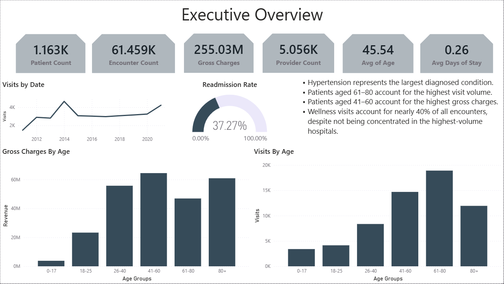
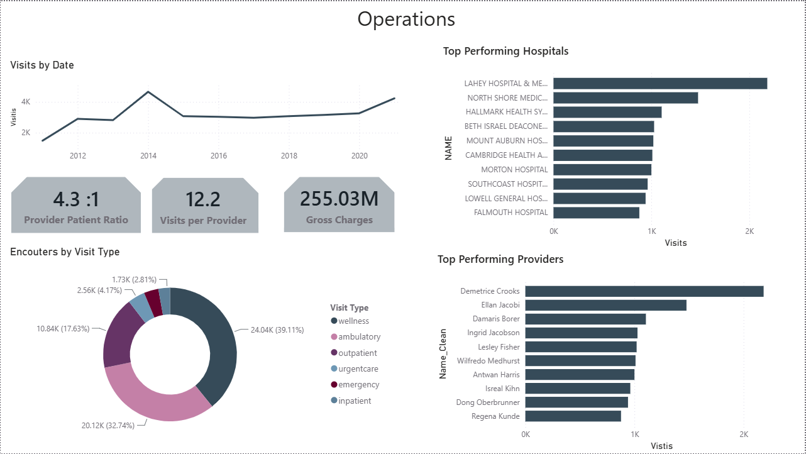
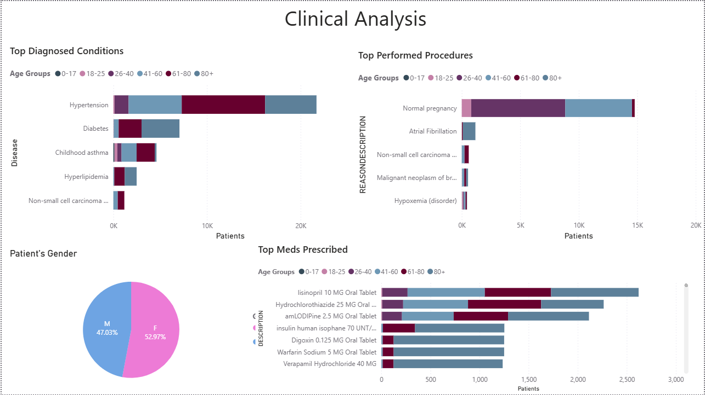

# Healthcare Executive Dashboard | Power BI

## Project Overview

This project presents an executive-level healthcare dashboard built in Power BI using the Synthea synthetic healthcare dataset.

The objective was to simulate a real consulting engagement where hospital executives require actionable insights into patient demographics, operational performance, clinical trends, and hospital utilization.

The dashboard focuses on transforming raw healthcare data into meaningful KPIs and visualizations that support strategic decision-making.

## Business Scenario

A hospital executive team requested a dashboard to answer questions such as:

• How many patients are we treating?
• Which age groups generate the highest utilization?
• Which hospitals and providers handle the highest workloads?
• What are the most common clinical conditions?
• What is our readmission rate?
• How are gross charges distributed across patient groups?

## Dataset

Source:
Synthea™ Synthetic Patient Generator

The dataset contains synthetic electronic health records generated for educational and analytical purposes.

Main tables used:

- Patients
- Encounters
- Conditions
- Procedures
- Medications
- Organizations
- Providers

## Dashboard Pages

### Executive Overview

Executive KPIs including:

- Patient Count
- Encounter Count
- Gross Charges
- Provider Count
- Average Age
- Average Length of Stay
- Readmission Rate

---

### Operations

Operational analysis including:

- Visits over time
- Provider-to-patient ratio
- Visit distribution
- Top performing hospitals
- Top performing providers

---

### Clinical Analysis

Clinical trends including:

- Top diagnosed conditions
- Most performed procedures
- Most prescribed medications
- Patient gender distribution

---

 ## Assumptions

Synthea does not simulate hospital payment collection or accounts receivable.

For analytical purposes:

• Gross Charges represent the sum of encounter claim costs.
• Readmission was calculated using encounters occurring within the defined time window.
• All findings are based on synthetic healthcare data and are intended for portfolio demonstration.

## Tools

Power BI

Power Query

DAX

Synthea Dataset

## Scrrenshots

